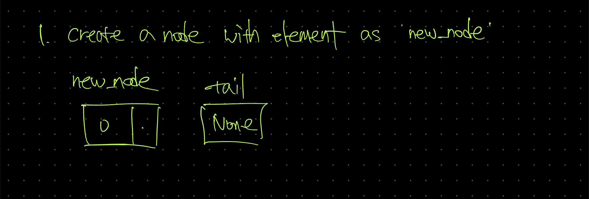
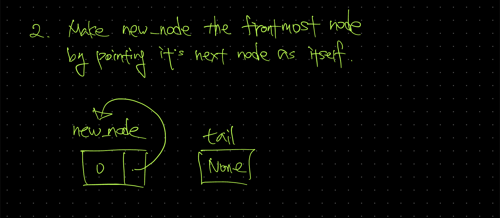
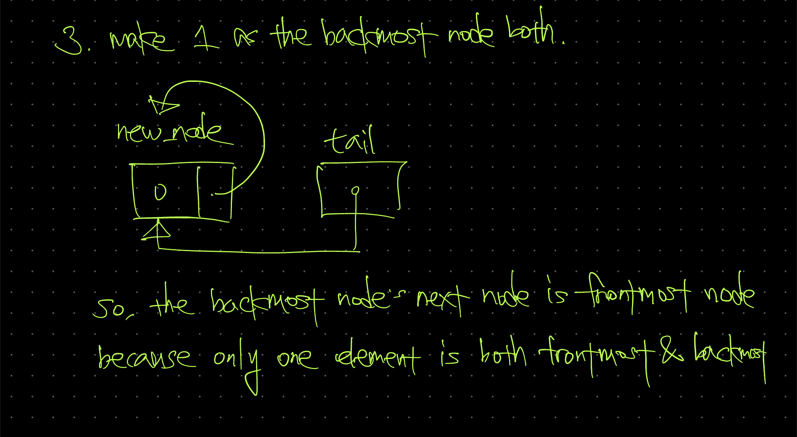
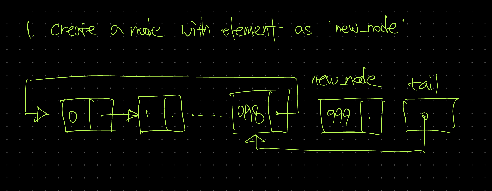
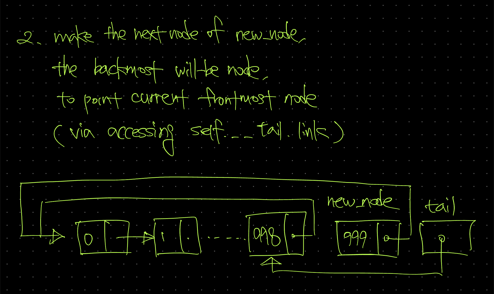
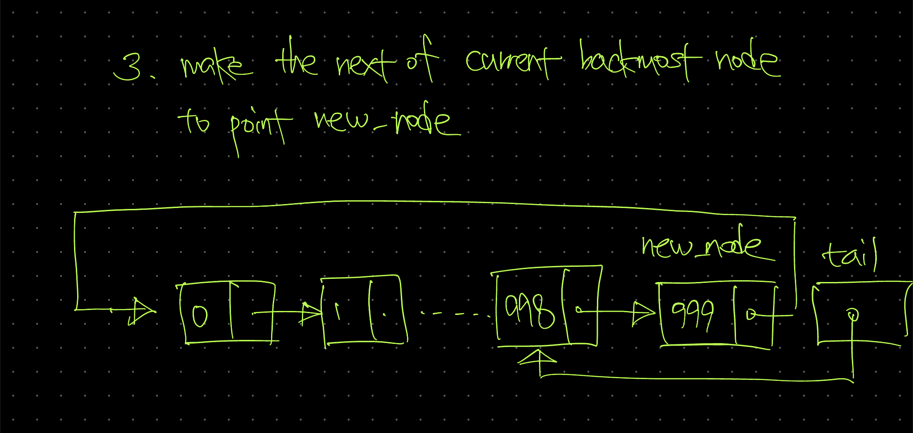
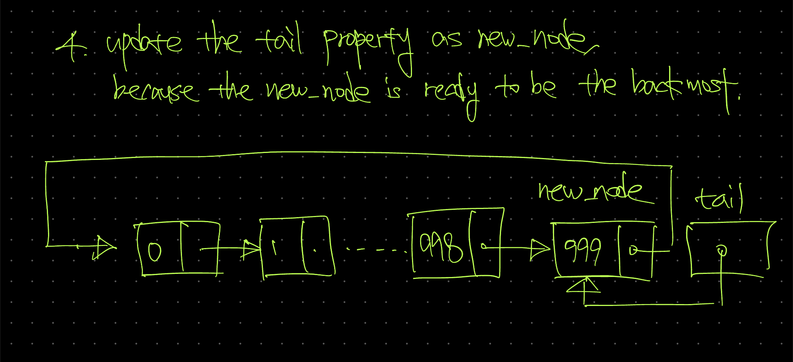
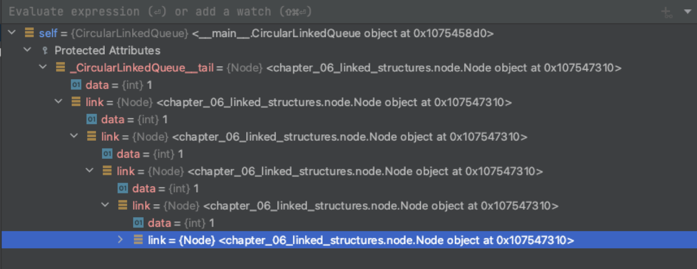

# Circular queue /w linked structure - CircularLinkedQueue

# Description

## Goal

- 이전엔
    - `front` 와 `rear` 라는 두 개의 property
    - acyclic linked data
    
    를 사용해 `LinkedQueue` 를 구현했다.
    
- 이번엔
    - `tail` 이라는 한 개의 property
    - cyclic linked data
    
     를 사용해 `CircularLinkedQueue` 를 구현할 것이다.
    

## Differences

### non-linked structure based

- linked structure 기반이 아닌, python 에 내장된 `list` 를 기반으로 구현한 queue 와 circular queue 를 기억해보자.
- 일반 queue 의 경우
    - `enqueue` : `rear` 위치에 element 를 새로 allocate 하는 단순한 작업. `O(1)` 만큼의 time complexity 를 필요로 하였다.
    - `dequeue`: `front` 위치에 존재하던 element 를 제거하고, 제거된 element 비어있는 위치를 처리하기 위해 {전체 element 갯수} - 1 번 만큼의 연산, 즉 `O(n)` 의 time complexity 를 필요로 한다.
    - 대신, python 에 내장된 `list` 가 dynamic array 인 만큼 queue 의 size 는 고려하지 않아도 되었다.
- circular queue 의 경우
    - `enqueue`: non-circular queue 와 마찬가지로 re-allocation 과정이 필요없는 작업이기에 time complexity 는 `O(1)` 이다.
    - `dequeue`: circular queue 의 `front`, `rear` 의 manipulation 은 정해진 size 를 넘지 않게 일반적으론 시계방향으로(clockwise) 회전한다.
        - front 라는 위치에 존재하던 element 를 제거 및 반환하고, front  의 값을 변경해주기만 하면 되는 문제이기에 이 또한 (circular - non-circular 무관하게) enqueue 와 같은 time complexity 인 `O(1)` 을 필요로 한다.
    - 대신, queue 의 size 가 정해져 있기에, 그보다 더 많은 element 를 담을 수는 없다는 단점이 존재한다.

### linked structure based

- 이번에는 자체적으로 구현한 `Node` 라는 class 를 사용하여 구성한 linked structure 기반의 non-circular queue 와 circular queue 비교해보자.
- non-circular (based on non-cyclic liked structure) queue 의 경우
    - `enqueue`: front 와 rear 를 통해 node 에 접근하고, 가장 마지막 node 의 위치(== memory address)를 가지고 있는 rear 의 다음에 새로운 Node 를 할당(되어 생긴 memory address) 하는 방식으로 작동한다. 그렇기에 time complexity 는 `O(1)` 이다.
    - `dequeue`: front 에 있던 element 를 반환하고, front property 를 `[front.next](http://front.next)` 로, 그러니까 front 의 다음 Node 의 주소정보로 재할당하는 연산만을 필요로 한다. 그렇기에 time complexity 는 `O(1)` 이다.

### circular queue based on cyclic linked structure

- 그러면 이번에 알아보고자 하는 cyclic linked structure 기반의 circular queue 는 어떤 차이점이 있을까?
- 먼저 `enqueue` 와 `dequeue` 의 time complexity 는 non-cyclic linked structure 기반으로 만들어진 queue 와 똑같다. 즉, `O(1)` 이며, time complexity 상의 이점은 없다.
- 차이점이 있다면 property 이다. non-cyclic linked structure queue 는 전단과 후단을 각각 나타내는 `front` 와 `rear` 를 둘 다 사용했지만, cyclic-linked structure queue 는 `rear` 하나만으로도 충분히 구현할 수 있다.
    - 왜냐면, `rear` 의 다음이 `front` 가 되는, 끝의 다음이 처음인, 순환되는(cyclic) 구조의 linked structure 이기 때문이다.

# ADT

## Draft

```python
def is_empty -> bool:
	# queue 가 비어있는지 여부를 검사한 값을 bool(ean) type 으로 반환한다

def display() -> list[int]:
	# queue 의 front 부터 rear 까지 위치한 element 들을 반환한다

def enqueue(element: int) -> None: 
	# element 를 rear 에 넣는다

def dequeue() -> Optional[int]:
	# front(rear.link) 에 있는 element 를 queue 에서 제거한 후 반환한다

def peek() -> Optional[int]:
	# front 에 있는 element 를 반환한다.
```

## Detailed with class

```python
class CircularCyclicLinkedQueue:
	def __init__(self):
		self.rear = None
		# 가장 끝 부분인 rear 를 property 로 가진다
		# 생성 직후의 초기값은 None 으로 할당한다

	def is_empty -> bool:
		# queue 가 비어있는지 여부를 검사한 값을 bool(ean) type 으로 반환한다
	
	def display() -> list[int]:
		# queue 의 front 부터 rear 까지 위치한 element 들을 반환한다
	
	def enqueue(element: int) -> None: 
		# element 를 rear 에 넣는다
	
	def dequeue() -> Optional[int]:
		# front(rear.link) 에 있는 element 를 queue 에서 제거한 후 반환한다
	
	def peek() -> Optional[int]:
		# front 에 있는 element 를 반환한다.
```

# Implementation

## enqueue

- enqueue 를 고려하기 전, 상황을 크게는 두 가지로 분리해서 생각해야 한다.
    - 아무것도 없는 상황에서 처음 enqueue 를 하는 상황
    - 이미 queue 에 element 가 있는 상태에서 enqueue 를 하는 상황
- 그 이유는, `rear` 와 그 `rear` 에 의해 정해지는 (property 상으론 존재하진 않는) `front` 의 운용 때문이다.

### enqueue when the queue is empty

```python
def enqueue(self, element: int) -> None:
        new_node = Node(element)

        if self.is_empty():
            new_node.link = new_node
            self.__tail = new_node
            return
```

---

- 위에 class 를 기반으로 작성한 ADT 에서, 비어있는 queue 의 상황에서 enqueue 를 하는 경우엔 front(그러니까, rear 의 다음, 즉 `rear.link`) 처리를 유의해서 해 주어야 한다.



- 가장 먼저, `Node` 를 만들어준다. 구체적이고 명확하게 기술해 보자면
    - `new_node` 라는 이름의 변수를 선언(declare)한다.
    - 해당 변수에 argument 로 받은 int(eger) type 의 element 를 통해 만든 `Node` 의 instance 를 할당한다.



- 그 다음, 해당 `new_node` 의 다음 node (의 메모리 주소값)을 의미하는 `new_node.link` 에 본인 자신을 할당한다.
    - 왜냐면 cyclic linked structure 를 기반으로 만드는 것이니만큼, 가장 마지막 node 의 다음 node 는 가장 처음의 node 가 되어야 하기 때문이다.
    - 그래서, queue 내에 element 가 단 하나밖에 존재하지 않는 상황, 즉, 본인이 가장 마지막 node 이자 가장 처음 node 인 상황에선 본인이 마지막 node 이면서, 또 동시에 첫 node 가 될 수 밖에 없다.



- 그 다음, rear 라는 class 의 property 에 해당 node#0(의 메모리 상의 주소)를 할당한다.
- 0개에서 1개로 늘어나는 상황에 진행되는 enqueue 는 이 정도의 과정으로 마무리된다.

### enqueue when the queue is not empty

```python
def enqueue(self, element: int) -> None:
        new_node = Node(element)

        if self.is_empty():
            new_node.link = new_node
            self.__tail = new_node
            return

        new_node.link = self.__tail.link
        self.__tail.link = new_node
        self.__tail = new_node
```

---



- 일단은 삽입할 node 를 똑같이 만들어준다.



- 그 다음에는 가장 마지막에 추가된 node 의 다음 node 가 가장 처음 node 를 가리키게 해야 한다.
- 이를 위해서
    - 현재의 첫 node 의 메모리 주소를
        - 현재의 가장 마지막 node 의 다음 node 의 위치를 통해 접근하여 가지고 온 다음
    - 가장 마지막 node 가 될 `new_node` 의 다음 node 의 주소값을 저장하는 곳에
        - `new_node.link` 를 통해 접근하여 할당한다

 



- 그 다음에는 현재의 가장 마지막 node 의 다음 node 가 앞으로 가장 마지막 node 가 될 node 가 되게끔 해 주어야 한다.
- 이를 위해서
    - 가장 마지막 node 의 다음 node 를
        - `self.__rear.link` 를 통해 접근한다음
    - 그곳에 가장 마지막 node 가 될 node 의 메모리 주소값을
        - `new_node` 을 통하여 할당한다.



- 이제 가장 끝 node 가 new_node 로 변경되었으니, 가장 끝 node 를 가리키는 property 인 `tail` 도 갱신해준다.

### code with comments

```python
class CircularLinkedQueue:
    def __init__(self):
        self.__tail: Optional[Node] = None

    def is_empty(self) -> bool:
        return self.__tail is None
	
		#...

    def enqueue(self, element: int) -> None:
        new_node = Node(element)

        if self.is_empty():
            new_node.link = new_node
            self.__tail = new_node
            return

        # goal: make back-most will-be node's next node
        #       to point current front-most node's memory address
        # set
        # - where: back-most will-be node's next node
        #   - via: new_node.link
        # - what: current front-most node's memory address
        #   - via: self.__tail.link
        new_node.link = self.__tail.link

        # goal: make current back-most node's next node
        #       to point back-most will-be node's memory address
        # set
        # - where: current back-most node's next node
        #   - via: self.__tail.link
        # - what: back-most will-be node's memory address
        #   - via: new_node
        self.__tail.link = new_node

        # goal: update the tail property to new back-most node
        # set
        # - where: self.__tail
        # - what: new_node
        self.__tail = new_node
```

## dequeue

- dequeue 를 고려하기 전에도, 상황을 나누어서 생각해야 한다.
    - element 가 없을 때
    - element 가 단 하나만 존재할 때
    - element 가 두 개 이상 존재할 때
- 왜 단 하나만 존재할 때와 두 개 이상 존재할 때를 나누는지에 대해서는 하술하고자 한다.

### dequeue when the queue is empty

```python
def dequeue(self) -> Optional[int]:
        # if the queue is empty, return None
        if self.is_empty():
            return None
```

---

- element 가 없을 때는 `is_empty()` method 로 비어있는지 여부를 검사하여, 비어있는 경우 `None` 을 반환한다.

### dequeue when the number of element is same or larger than two

```python
def dequeue(self) -> Optional[int]:
        # if the queue is empty, return None
        if self.is_empty():
            return None

        node_to_return = self.__tail.link

        self.__tail.link = self.__tail.link.link
        return node_to_return.data
```

---

- `node_to_return` 이라는 변수를 선언하고, 해당 변수를 현재 가장 앞에 있는 element (== 가장 먼저 들어온 element)의 메모리 주소값으로 초기화한다.
    - 현재 가장 앞에 있는 element 에 접근하는 방법은 `self.__tail.link` 를 사용하도록 한다.

### dequeue when the number of elements of queue is one

- 코드를 개시하기 전, 위에 있는 방식으로 해당 경우도 처리할 수 있지 않을까 생각해 보았으나 그러지 못 한다는 사실을 알게 되었다.
    - 왜냐하면, queue 에 element 가 1개만 남은 상황에선, frontmost element 가 동시에 backmost element 이기 때문이다.
    - 이 특성은 cyclic linked structure 에 기반하여 구현된 나머지 본인 다음의 element 가 본인을 가리키는 상황을 야기하게 되는데, 그렇기에 위에 나온 `self.__tail.link = self.__tail.link.link` 와 같은 재할당 방식이 작동할 수 없다.
        - 왜냐하면 본인의 다음이 곧 본인이고, 본인의 다음의 다음도 곧 본인이기에 위와 같은 할당은 끝을 내지 못하고 계속해서 순환하기(cyclic) 때문이다.



- 사진은 위와 같은 경우를 `self.__tail.link = self.__tail.link.link` 로 처리하면 어떤 일이 벌어지는지를 직접 구현하고, debugger 를 통해 확인해 본 상황이다. 메모리 주소가 `0x107547310` 인 `Node` instance 를 순환적으로(cyclic) 가리키는 걸 볼 수 있다.

```python
def dequeue(self) -> Optional[int]:
        if self.is_empty():
            return None

        node_to_return = self.__tail.link

        if self.__tail is self.__tail.link:
            self.__tail = None
            return node_to_return.data

        self.__tail.link = self.__tail.link.link
        return node_to_return.data
```

---

- 그래서 해당 상황은 별도의 조건을 걸어 분기를 한 뒤 처리해 주어야 한다.
    - cyclic 한 상황을 감지하고자 하는 것이기에, `self.__tail is self.__tail.link` 라는 조건으로 감지할 수 있다.
- 해당 상황은
    - `self.__tail` 을 `None` 으로 초기화
    - frontmost element 를 담고 있던 `node_to_return` 의 data 라는 property 를 반환
    
    하는 과정으로 마무리를 지어야 한다.  
    

### code with comments

```python
class CircularLinkedQueue:
    def __init__(self):
        self.__tail: Optional[Node] = None

    def is_empty(self) -> bool:
        return self.__tail is None

    #...

    def dequeue(self) -> Optional[int]:
        # if the queue is empty, return None
        if self.is_empty():
            return None

        # make a variable 'node_to_return'
        # to hold the current front-most node
        #  - via self.__tail.link
        node_to_return = self.__tail.link

        # if there is only one element in queue,
        # set tail as None and return the variable, node_to_return
        if self.__tail is self.__tail.link:
            self.__tail = None
            return node_to_return.data

        # if there are elements more than 2 in queue,
        # set tail.link(== head) as tail.link.link(head.link)
        self.__tail.link = self.__tail.link.link
        # and return it
        return node_to_return.data
```

## size

```python
def size(self) -> int:
        if self.is_empty():
            return 0

        count = 1
        current_node = self.__tail.link

        while current_node is not self.__tail:
            current_node = current_node.link
            count += 1

        return count
```

- size method 는 queue 에 담겨있는 node 의 갯수를 반환하는 기능을 수행한다.

---

- 만약 queue 가 비어있다면 (`if self.is_empty()`), element 의 갯수는 0 이기에 0을 반환해준다.
- size 를 확인할 count 라는 변수를 선언 후, 1로 초기화 해준다.
- 순회할 지점을 가리키는 pointer 로 사용할 `current_node` 라는 변수를 선언 후, 첫 번째 node 인 `self.__tail.link` 로 초기화 해준다.
- current node 의 memory address 가 self.__tail 가 다른 동안
    - `current_node` 에 `current_node.link` 를 재할당
    - `count += 1` 연산을 수행
    
    하고, 해당 과정이 종료되면 `count` 를 결과값으로 반환한다.
    

## display

```python
def display(self) -> list[int]:
        if self.is_empty():
            return []

        container = []
        current_node = self.__tail.link

        while current_node is not self.__tail:
            container.append(current_node.data)
            current_node = current_node.link

        return container
```

- display method 는 queue 에 어떤 element 들이 담겨있는지를 front 부터 tail 까지의 순서대로 list 에 담아 반환하는 역할을 한다.

---

- 작동하는 방식은 상술한 `size` method 와 거의 유사하다.
- container 라는 변수를 만들고 python 의 내장된 list 를 비어있는 상태로 할당한다.
- while loop 을 돌 때마다
    - 현재 node 를 담은 `current_node` 의 `data` property 를 append 한다.
    - current_node 에 그 다음 node 인 `current_node.link` 를 재할당한다.

## whole code

```python
from chapter_06_linked_structures.node import Node
from typing import Optional

class CircularLinkedQueue:
    def __init__(self):
        self.__tail: Optional[Node] = None

    def is_empty(self) -> bool:
        return self.__tail is None

    def clear(self) -> None:
        self.__tail = None

    def peek(self) -> Optional[int]:
        if not self.is_empty():
            return self.__tail.data
        return None

    def enqueue(self, element: int) -> None:
        new_node = Node(element)

        if self.is_empty():
            new_node.link = new_node
            self.__tail = new_node
            return

        # goal: make back-most will-be node's next node
        #       to point current front-most node's memory address
        # set
        # - where: back-most will-be node's next node
        #   - via: new_node.link
        # - what: current front-most node's memory address
        #   - via: self.__tail.link
        new_node.link = self.__tail.link

        # goal: make current back-most node's next node
        #       to point back-most will-be node's memory address
        # set
        # - where: current back-most node's next node
        #   - via: self.__tail.link
        # - what: back-most will-be node's memory address
        #   - via: new_node
        self.__tail.link = new_node

        # goal: update the tail property to new back-most node
        # set
        # - where: self.__tail
        # - what: new_node
        self.__tail = new_node

    def dequeue(self) -> Optional[int]:
        # if the queue is empty, return None
        if self.is_empty():
            return None

        # make a variable 'node_to_return'
        # to hold the current front-most node
        #  - via self.__tail.link
        node_to_return = self.__tail.link

        # if there is only one element in queue,
        # set tail as None and return the variable, node_to_return
        if self.__tail is self.__tail.link:
            self.__tail = None
            return node_to_return.data

        # if there are elements more than 2 in queue,
        # set tail.link(== head) as tail.link.link(head.link)
        self.__tail.link = self.__tail.link.link
        # and return it
        return node_to_return.data

    def size(self) -> int:
        if self.is_empty():
            return 0

        count = 1
        current_node = self.__tail.link

        while current_node is not self.__tail:
            current_node = current_node.link
            count += 1

        return count

    def display(self) -> list[int]:
        if self.is_empty():
            return []

        container = []
        current_node = self.__tail.link

        while current_node is not self.__tail:
            container.append(current_node.data)
            current_node = current_node.link

        return container
```

# Testing

```python
def test_circular_linked_queue_enqueue():
    clq = CircularLinkedQueue()

    number_of_enqueue = 3

    for i in range(number_of_enqueue):
        clq.enqueue(i)

    assert clq.size() == number_of_enqueue

def test_circular_linked_queue_dequeue_after_enqueue():
    clq = CircularLinkedQueue()

    number_of_enqueue = 3
    first_element = 999999

    for i in range(number_of_enqueue):
        if i == 0:
            first_element = i
        clq.enqueue(i)

    head = clq.dequeue()

    assert first_element == head
```