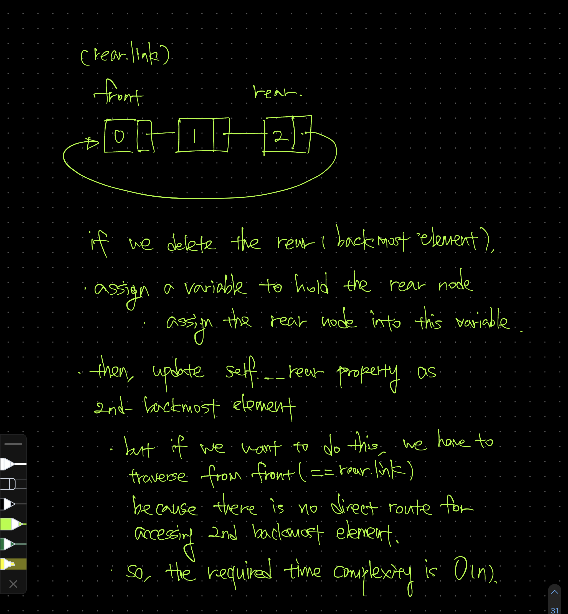

# Dequeue /w linked structure - LinkedDequeue

# Description

- 이번엔 이전에 구현했던 front / rear 삽입이 전부 가능한 data structure 인 `dequeue` 을 linked data structure 를 기반으로 구현해보자.

## Using DoublyNode

- 이전엔 singly linked data structure, 즉 다음 주소만을 알고 있었던 `Node` 라는 자료형이 아닌,
    - 이전 주소
    - 다음 주소
    
    를 모두 알고 있는, doubly linked data structure 인 `DoublyNode` 라는 자료형을 이용할 것이다.
    

## Before design it: why using DoublyNode?

- ‘왜 doubly linked data structure 를 이용할까?’ 라는 의문을 가지기 전, singly linked data structure 를 통해 dequeue 를 구현해보자.
    - queue 를 통해 rear 에 삽입 / front 에서 제거 하는 작업은 `O(1)` time complexity 로 구현을 하였고, 추가적으로 `add_front` (front 에 삽입), `delete_rear` (delete 에서 제거) 만 구현하면 dequeue 의 필수적인 method 들은 전부 완성이 된다.

### implement delete_rear with singly linked structure



- queue 를 사용했던 것처럼 rear 라는 property 하나만을 이용하고, rear.link 로 front 를 mapping 하는, cyclic 한 구조에서 `delete_rear` 를 구현하려면 time complexity `O(n)` 만큼의 연산을 해야 한다.
- 그 이유는, rear 의 이전 element(Node) 에 바로 접근할 수 있는 경로가 존재하지 않기 때문이다.
    - 물론 접근하고자 하려면 할 수 있는 방법이 존재한다. `rear.link` 를 통해 frontmost element 로 이동한 뒤, 다음 element 의 memory address 가 현재의 rear 와 memory address 와 일치하는 경우 그 element 가 rear 의 바로 직전 Node 라는 조건을 통해서.
    - 그러나, 이는 front (rear.link) 부터 rear 의 직전 Node 의 갯수만큼 순회를 해야 한다. 그렇기에 time complexity 가 `O(n)` 인 것이다.

### implement add_front with singly linked structure


- `add_front` 자체는 문제가 없다. 똑같이 O(1) time complexity 를 소요한다.

### conclusion

- `delete_rear` 에서 O(n)으로 time complexity 가 증가하는 상황을 해결하기 위해 구조를 조금 변경하는 게 좋아 보인다. 동시에, 더 나은 대안이 있다는 가정 하에, singly linked data structure based 는 optimal 한 해결책은 아니라는 결론을 내릴 수 있다.

# Design LinkedDequeue /w doubly linked node (as DoublyNode)

- 만약 `delete_rear` 를 하는 상황에서, 현재의 rear 가 이후(==`rear.link`==`front`) Node 뿐만 아니라, ‘이전’ Node 에 바로 접근할 수 있게 된다면, delete_rear 에 요구되는 time complexity 는 `O(1)` 이 된다.
    - 그렇다면 이를 위해서, Node 의 구조를
        - Node 의 다음 Node (Node.next)
        - Node 의 이전 Node (Node.prev)
        
        를 둘 다 알 수 있게 변경하는 과정이 필요하다.
        

## Design DoublyNode

```python
from typing import Optional

class DoublyNode:
    def __init__(
            self,
            data: int,
            prev: Optional['DoublyNode'] = None,
            rear: Optional['DoublyNode'] = None,
    ):
        self.data = data
        self.prev = prev
        self.rear = rear

```

- 위의 조건을 충족하는 `DoublyNode` class 를 구현하였다.

## Design LinkedDequeue

### Abstract Data Type - ADT

```python
from typing import Optional
from chapter_06_linked_structures.doubly_node import DoublyNode

class DoublyLinkedDequeue:
    def __init__(self):
        self.__front: Optional[DoublyNode] = None
        self.__rear: Optional[DoublyNode] = None

    def is_empty(self) -> bool:
        return self.__front is None

    def clear(self) -> None:
        self.__front = self.__rear = None

    def size(self) -> int:
        current_node = self.__front
        size_of_dequeue = 0

        while current_node is not None:
            size_of_dequeue += 1
            current_node = current_node.next

        return size_of_dequeue

    def display(self) -> list[int]:
        current_node = self.__front
        elements_in_dequeue = []

        while current_node.next is not None:
            elements_in_dequeue.append(current_node.data)
            current_node = current_node.next

        return elements_in_dequeue

    def add_front(self, element: int) -> None:
        pass

    def add_rear(self) -> None:
        pass

    def delete_front(self) -> Optional[int]:
        pass

    def delete_rear(self) -> Optional[int]:
        pass
```

- 사실 `is_empty`, `clear`, `size`, `display` 는 linked stack 에서 사용한 그대로를 사용하면 된다. 그래서 ADT 를 정의하는 상황에서도 어느정도 적어놓고 넘어가기로 하고, `prev` 와 `next` property 를 사용하여 조금 더 신경을 써야 할 add / delete 연산을 중점적으로 고려해보기로 하자.

## add_front

```python
def add_front(self, element: int) -> None:
    node_to_add = DoublyNode(element, None, self.__front)

    if self.is_empty():
        self.__front = self.__rear = node_to_add
        return

    self.__front.prev = node_to_add
    self.__front = node_to_add
```

- `add_front` 과정을 하나하나 나눠보면 아래와 같다.
    - `node_to_add` 라는 변수를 선언
        - `element` 를 가지고 DoublyNode  instance 생성한 뒤 할당
            - `data` property 에는 element 를 넣음
            - `next` property 에는 `self.__front` 를 넣어, 다음 주소가 front 임을 명시함
            - `prev` property 는 해당 element 가 frontmost element 가 되는 만큼, `None` 으로 처리함
    - 만약 해당 dequeue 가 비어있다면, 즉, `self.__front` 가 `None` 이라면, `self.__front` 와 `self.__rear` 전부 node 를 할당해 주고 연산을 마무리함
    - 그렇지 않다면, `self.__front` 의 이전 node, 즉 `self.__front.prev` 에 `node_to_add` 의 주소를 할당하고, `node_to_add` 를 `self.__front` 에 할당 시키는 것으로 연산을 마무리함

## add_rear

```python
def add_rear(self, element: int) -> None:
    node_to_add = DoublyNode(element, self.__rear, None)

    if self.is_empty():
        self.__front = self.__rear = node_to_add
        return

    self.__rear.next = node_to_add
    self.__rear = node_to_add
```

- `add_rear` 절차는 `add_front` 와 유사하다. 마찬가지로 과정을 하나하나 나누어 본다면, 아래와 같다.
- `node_to_add` 라는 변수를 선언한다
    - 해당 변수엔 `DoublyNode` 의 instance 를 만들어서 초기화를 하는데
        - `data` parameter 엔 `element` 를
        - `prev` parameter 엔 `node_to_add` 가 backmost element 가 될 것이기에 `self.__rear` 를
        - `next` element 엔 `node_to_add` 가 backmost element 가 될 것이기에 `None` 을
        
        할당해준다.
        
- 만약 dequeue 가 비어있다면, 즉 `self.__front` 가 `None` 이라면,
    - `self.__front` , 그리고 `self.__rear` 에 전부 `node_to_add` 를 할당해준다.
    - 그리고 `add_rear` method 를 종료한다.
- 비어있지 않았다면,
    - backmost element 가 될 수 있게 현재의 `self.__rear.next` 에 `node_to_add` 를 할당
    - `self.__rear` 에 `node_to_add` 를 할당
    
    하는 식으로 backmost element 임을 명백하게 해 준다.
    

## delete_*

- 해당 구조의 dequeue 에서 `delete_*` 연산을 처리하는 경우 공통적으로 확인해야 할 사항은 ‘dequeue 에 몇 개의 element 가 남아있냐’ 이다.
    - 0개가 남아있다면 dequeue 를 할 수 없다
    - 1개가 남아있다면 `delete_*` 를 하고, `self.__front` 와 `self.__rear` 를 전부 `None` 처리 해 주어 1개가 빠져나간 뒤 dequeue 를 명시적으로 비워준다
    - 2개 이상이 남아있다면, delete 를 한 뒤 prev / next / front / rear 관리를 해 준다

## delete_front

```python
def delete_front(self) -> int:
    if self.is_empty():
        raise Exception("This dequeue is empty")

    node_to_return = self.__front
    self.__front = self.__front.next

    if self.__front is None:
        self.__rear = None

    self.__front.prev = None

    return node_to_return.data
```

- 이건 내가 작성한 코드이다. 특이점이 있다면 나는 dequeue 이 비어있는 경우를 감지하고, 그 경우에 dequeue 를 하려고 할 때 exception 처리를 하였다.

```python
def delete_front(self):
	if not self.is_empty():
		data = self.front.data
		self.front = self.front.next
		
		if self.front is None:
			self.rear = None
		
		self.front.prev = None

		return data
```

- 이건 교재에서 reference 로 만들어 준 코드이다. accessor 나 type hint 를 제외하고 가장 큰 차이점은 현재의 dequeue 이 empty 가 아닌 경우에만 저 연산을 수행한다는 것이다.
- nested condition 가 complextiy 를 높인다고 생각하고, exception 을 반환해 주어야 하는 상황에서 명시적으로 exception 을 반환해야 한다고 생각해서 해당 코드에 약간의 수정을 가하였다.
- 거두절미하고, 핵심적인 과정을 의사코드로 옮겨보면 다음과 같다.
    - 변수를 하나 선언하고, 해당 변수를 반환할 현재의 frontmost element 로 초기화
    - frontmost element 를 그 다음 element 로 이동
        - 현재의 frontmost element property 를 frontmost element 의 다음 element 로 할당
    - 만약 이렇게 이동을 한 뒤 frontmost element 가 None, 즉 방금 처리한 element 가 마지막 남아있던 1개의 element 였다면, rear 도 `None` 으로 처리
    - 변경된 frontmost element 의 `prev` property 에 `None` 을 할당 (왜냐면, 이제 이 element 가 frontmost element 이기 때문에)
    - 저장하고 있던 element 의 data property 를 반환
- 해당 의사코드를 코드로 옮긴 것이 위의 코드들이다.

## delete_rear

```python
def delete_rear(self) -> int:
    if self.is_empty():
        raise Exception("This dequeue is empty")

    node_to_return = self.__rear
    self.__rear = self.__rear.prev

    if self.__rear is None:
        self.__front = None

    self.__rear.next = None

    return node_to_return.data
```

- `delete_front` 와 크게 다를 건 없다. frontmost element 가 아닌 backmost element 를 제거/반환하는 과정이라 처리해 주어야 하는 것들이 반대가 되었을 뿐. 그렇기에 설명은 생략한다.

## time complexity

- `add_front`
- `delete_front`
- `add_rear`
- `delete_rear`

의 time complexity 는 전부 `O(1)` 이다. 상술하였듯 singly node 를 사용하는 경우 `delete_rear` 에서 `O(n)` 만큼의 time complexity 를 필요로 하였던 상황을 개선하기 위해 doubly node 를 사용하여 개선한 게 이 결과물이니, 설명 또한 생략한다.