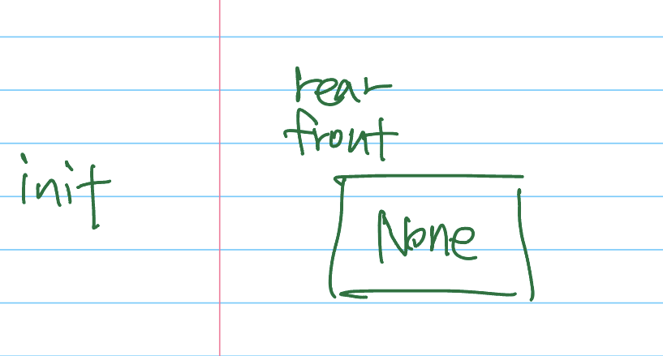
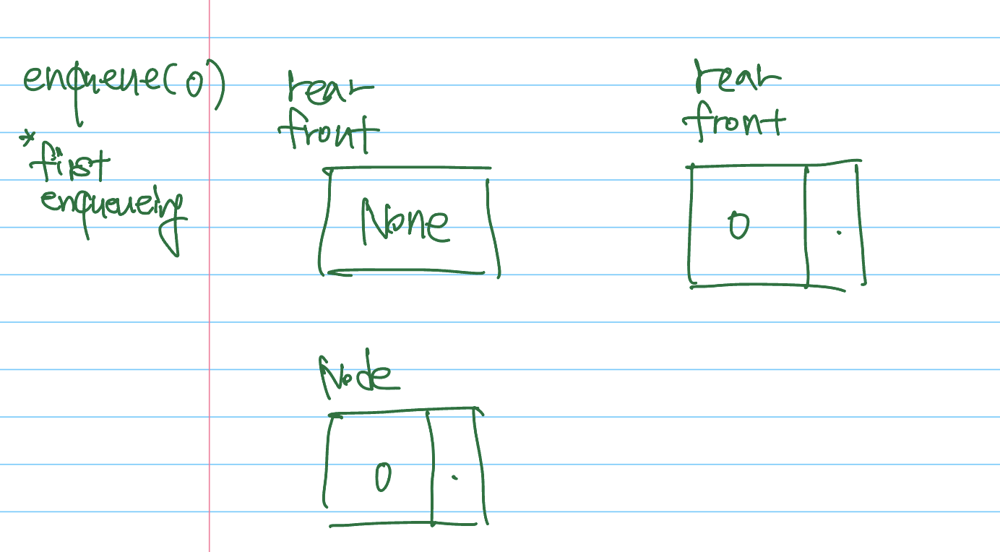
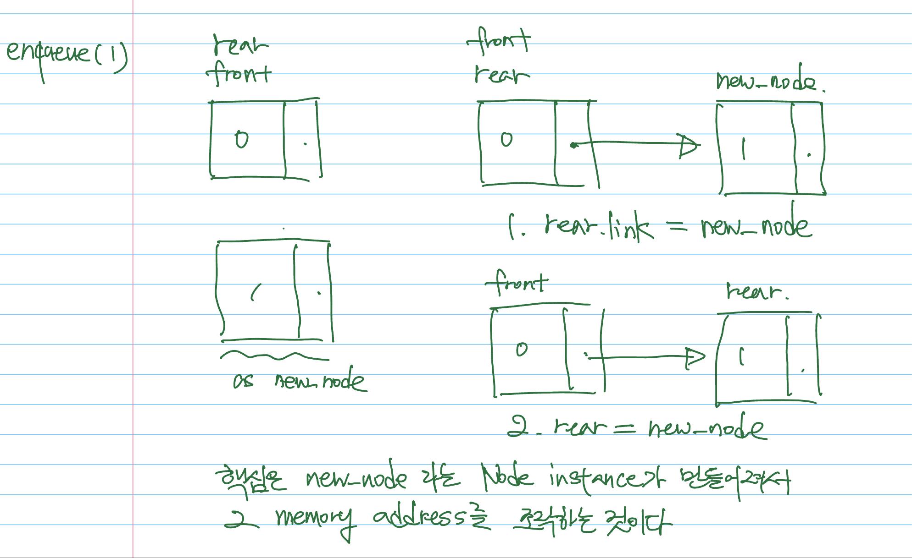
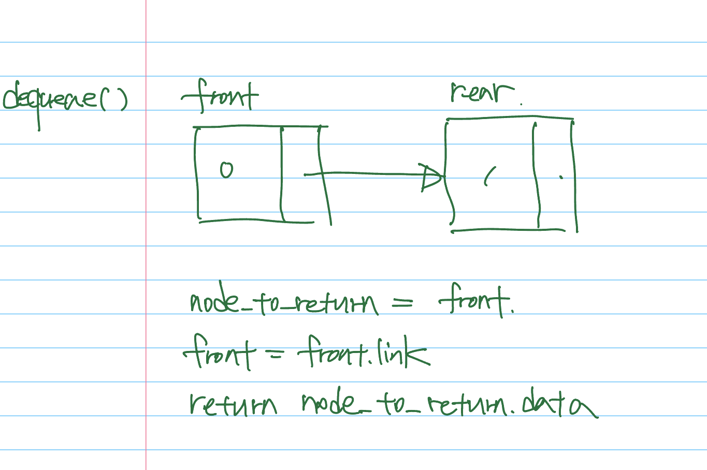
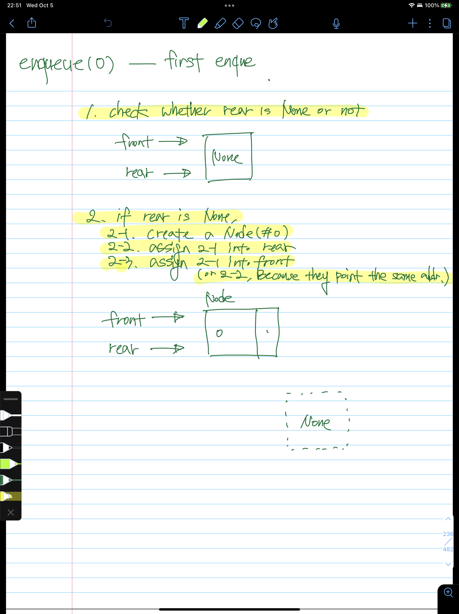
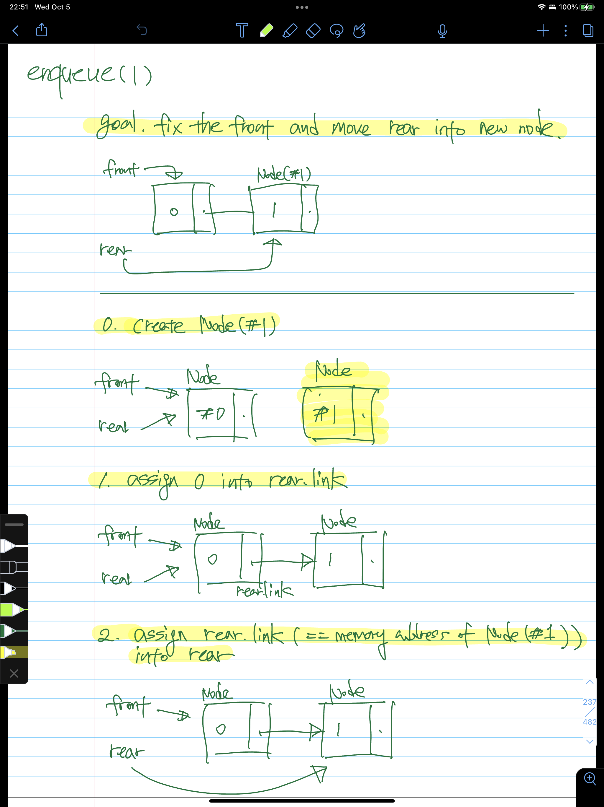
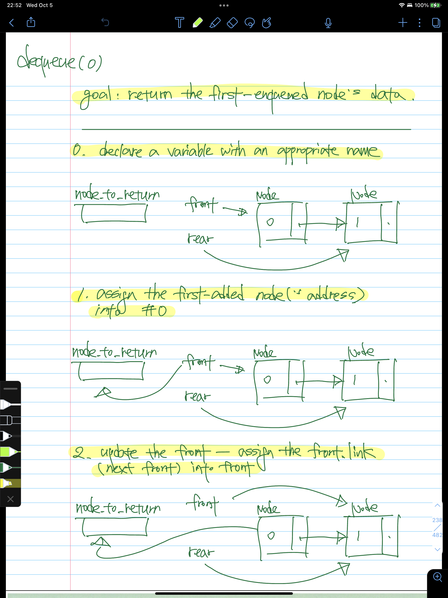

# Queue /w linked structure - LinkedQueue

# Description

- `Queue` 는 `FIFO` 가 가능해야 한다.
- 이를 위해선 `enqueue(element: Any) -> None:`  와 `dequeue() -> Any:` 라는 두 개의 method 가 필요하다.

---

# Requirements

- 그리고 이번엔 linked structure 기반의 queue 를 구현해야 한다.
- `Node` 라는 class 와 `head` 라는 property 를 통해 stack 을 구현한 것처럼, `Node` 라는 class 와 함께 `front` 와 `rear` 라는 property 를 이용해서 Queue 를 만들어야 한다.

---

# Abstract

## Basic structure

```python
class LinkedQueue:
    def __init__(self):
        self.__front: Optional[Node] = None
        self.__rear: Optional[Node] = None
```

- 먼저 `LinkedQueue` 의 초안을 만들어보자면 다음과 같을 것이다.
    - queue 의 맨 앞 부분을 가리키는 데 사용하는 property 인 `__front`
    - queue 의 맨 뒷 부분을 가리키는 데 사용하는 property 인 `__rear`

## enqueue

- enqueue 를 한다는 걸 명확하게 설명해 보자면 “queue 의 rear 의 다음 위치인 [rear.link](http://rear.link) 에, 새로 들어온 element 로 생성한 Node instance 를 할당한다” 라고 할 수 있겠다.

## dequeue

- dequeue 또한 명확하게 설명해 보자면, “queue 의 front 에 존재하던 Node instance 의 data property 를 반환한다” 라고 할 수 있겠다.

---

# Detail

## init



- LinkedQueue 라는 instance 가 만들어지고, front 와 rear 가 `None` 으로 초기화 된 시점을 의미한다.
    - 이 상황에서 `dequeue` 를 할 수는 없다, 왜냐하면 dequeue 를 하기 위해 `front` 를 사용하여 linked structure 들을 조작해야 하는데, 그 front 가 현재 None 으로 초기화 된 상태이기 때문이다.

## first enqueue



- init 에 기술된 상황 이후 처음으로 `enqueue` 를 하는 상황이다.
- 가장 먼저, element 라는 argument 로 들어온 value 를 통해, `Node` 를 만들어 주어야 한다. (이하 `Node#0`)
- 그리고, 그 `Node#0` 을 (정확히 말 하자면, `Node#0` 의 **메모리 공간 상의 주소**를) front 와 rear 에 할당한다.
- 코드로 정리하자면, 다음과 같다.
    
    ```python
    def enqueue(element: Any) -> None:
    	if self.__rear is None:
    		self.__rear = Node(element)
    		self.__front = self.__rear
    ```
    

## enqueue after the first enqueue



- 지금부터가 중요하다. 왜냐하면 이 과정이 앞으로 메모리에 올라간 instance 의 주소를 연결해 나가는 과정의 시발점이기 때문이다.
- element 로 들어온 value 를 통해 Node 를 만들어준다 (이하 `Node#1`)
- front 는 그대로 두고, rear 의 다음을 의미하는 `self.__rear.link` 에 `Node#1` 을(정확히 말 하자면, `Node#1` 의 **메모리 공간 상의 주소**를) 할당한다.
- 그리고, 새로운 element 가 rear 를 통해 들어왔으니, rear 를 이동해준다. `self.__rear = Node#1` 을 통해 rear 에 아까까지의 rear 의 다음 Node 로 할당되었던 `Node#1` (의 메모리 공간상의 주소)을 할당해준다.
- 위의 코드에 추가하여 코드로 나타내자면, 다음과 같다.
    
    ```python
    def enqueue(element: Any) -> None:
    	if self.__rear is None:
    		self.__rear = Node(element)
    		self.__front = self.__rear
    		return
    	
    	self.__rear.link = Node(element)
    	self.__rear = self.__rear.link
    ```
    
- 앞으로의 enqueue 과정들은 `self.__rear` 가 `None` 이 아니라 어떠한 Node (의 메모리 상의 주소) 가 존재하는 동안  조건문 밖의 과정들로 처리될 것이다.

## first dequeue



- 먼저 변수를 하나 선언하고, 그 변수에 현재의 `front` 를 할당하는 식으로 변수를 초기화 해준다.
- 그리고, `front` 에 다음 element 인 `front.link` 를 할당하는 방식으로 front 를 이동시켜 준다.
- 마지막으론, 갱신 전 front 를 담아 놓았던 변수(`Node` type)에서 `data` property 를 결과값으로 반환해준다.

---

# From the point of view of memory on computer





