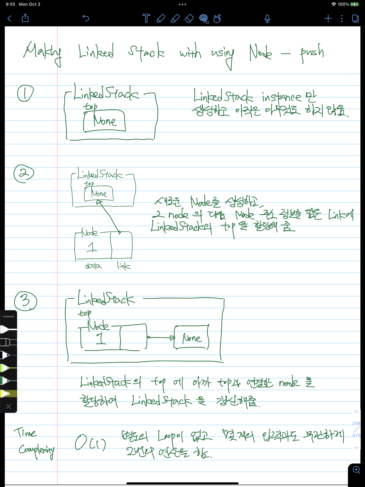
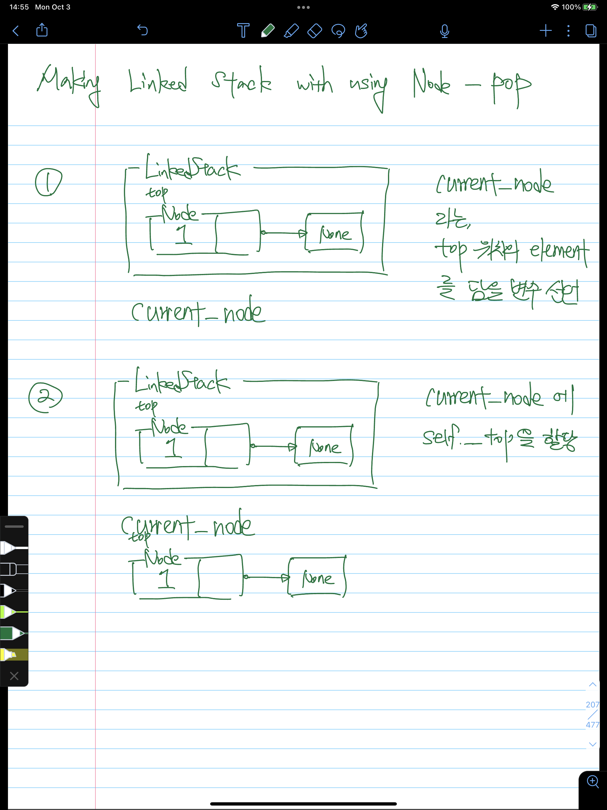
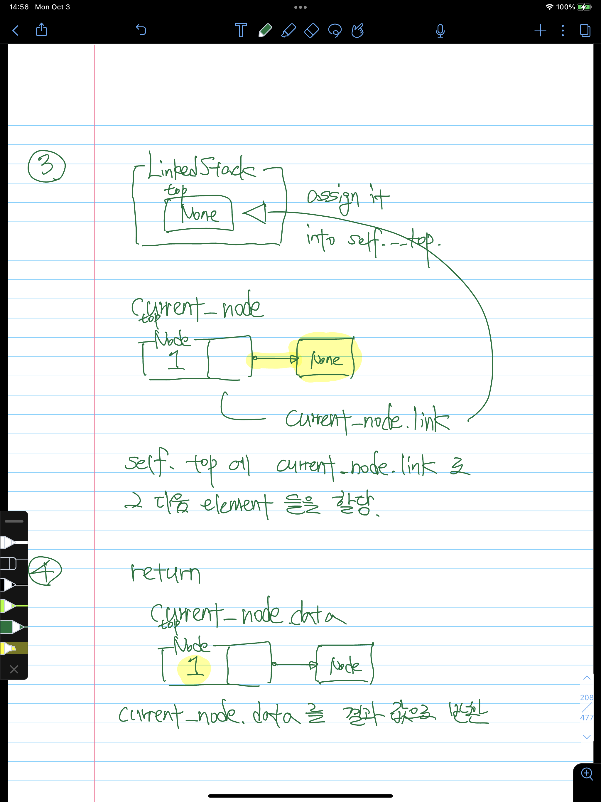

# Implement stack using node - LinkedStack

```python
from chapter_06_linked_structures.node import Node
from typing import Any, Optional

class LinkedStack:
    def __init__(self):
        self._top: Optional[Node] = None

    def __str__(self):
        print(self.display())

    def is_emtpy(self) -> None:
        return self._top is None

    def clear(self) -> None:
        self._top = None

    def push(self, element) -> None:
        new_node = Node(element, self._top)
        self._top = new_node

    def pop(self) -> Any:
        if not self.is_emtpy():
            next__top = self._top
            self._top = next__top.link

            return next__top.data

    def peek(self) -> Any:
        if not self.is_emtpy():
            return self._top.data

    def size(self) -> int:
        size_of_stack = 0
        current_node = self._top

        while current_node is not None:
            size_of_stack += 1
            current_node = current_node.link

        return size_of_stack

    def display(self) -> list[Any]:
        container = []
        current = self._top

        while current is not None:
            current = current.link
            container.append(current.data)

        return current
```

- 결국 stack 은 FILO, 먼저 들어간 것이 가장 나중에 나오는 것이다.
    - 이를 linked structure style 로 구현할 수 있다.

## Descriptions about methods of LinkedStack

### push(self, element: Any) → None:

- `push(self, element: Any)` 를 하는 경우엔 아래와 같은 과정을 거친다.
    - argument 로 들어온 element 를 통해 새로운 node 를 생성한다.
        - 해당 node 의 data parameter 엔 `element` 가 argument 로 들어간다.
        - 해당 node 의 link parameter 엔 `self.__top` 이 argument 로 들어간다.
    - `LinkedStack` 의 `self__top` 에 해당 node 를 할당한다.
        - 해당 과정의 의미는, 여태까지의 top 을 다음 link 로 하는 node 를 새로이 top 에 할당하는 것인데, 이것은 stack 에서 rear 에 값을 계속해서 넣는 것과 다를 게 없다.



- 좀 더 쉽게 이해하기 위해서 그림을 통해 해당 method 의 절차를 표현하자면 다음과 같다.

### pop(self) → Any:

- `pop(self)` 를 하는 경우엔 아래와 같은 과정을 거친다.
    - top 위치에 있는 element 를 담기 위해, `current_node` 라는 변수를 선언한다.
    - 해당 변수에 top 위치에 있는 element 를 할당한다.
    - 그리고, 해당 element 이후의 element 들을 `self.__top` 에 `self.__top = [self.top.link](http://self.top.link)` 와 같은 식으로 할당한다.
    - `current_node.data` 를 통해 top 위치에 있는 element 의 data 를 반환한다.





- 좀 더 쉽게 이해하기 위해서 그림을 통해 해당 method 의 절차를 표현하자면 다음과 같다.